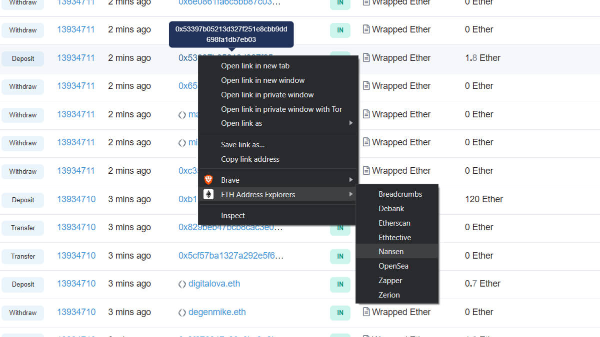
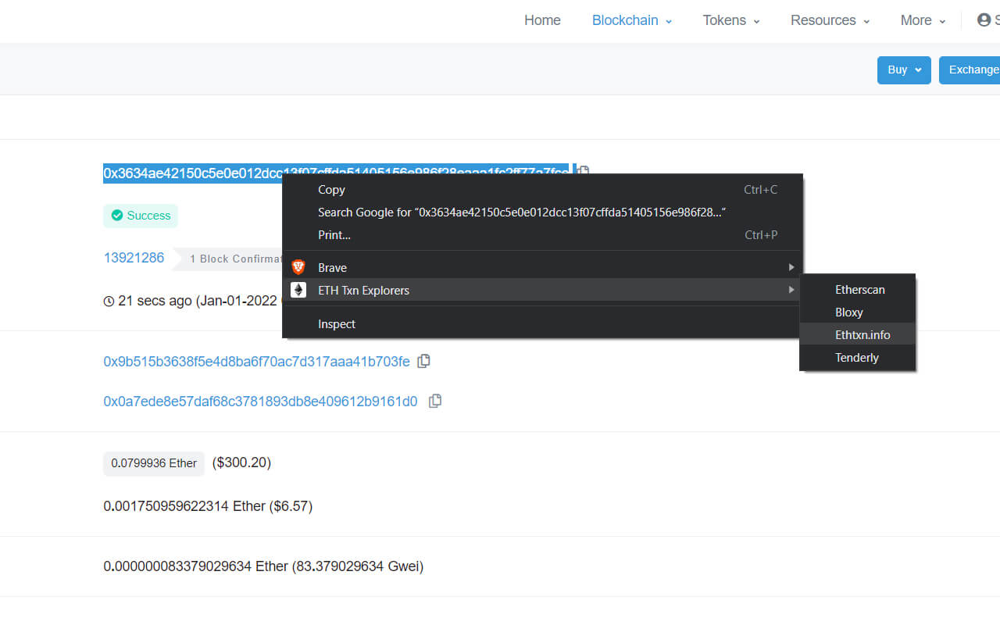

# eth-explorers-extension(s)

This repository contains two folders with two extensions that work for address and transactions respectively.

## 1. eth-address-explorers

Supercharge your Etherscan experience! Right-click on any address link and instantly analyze it on popular tools like Zapper, Nansen, OpenSea and more.

It also works on any page, by selecting the address text and right-clicking to choose from the list of explorers and dashboards.

## 2. eth-txn-explorers

Select transaction hash on any page, and easily view it on the most popular Ethereum explorers like Etherscan, Bloxy, Tenderly and Ethtxn.info.

## How to Install

1. Open the Extensions setting page in your browser.  
   

2. Enable Developer mode from top-right.  
   

3. Clone this repository locally.

4. Press "Load unpacked" and select this repository's sub-folders to install both the extensions.  
   
